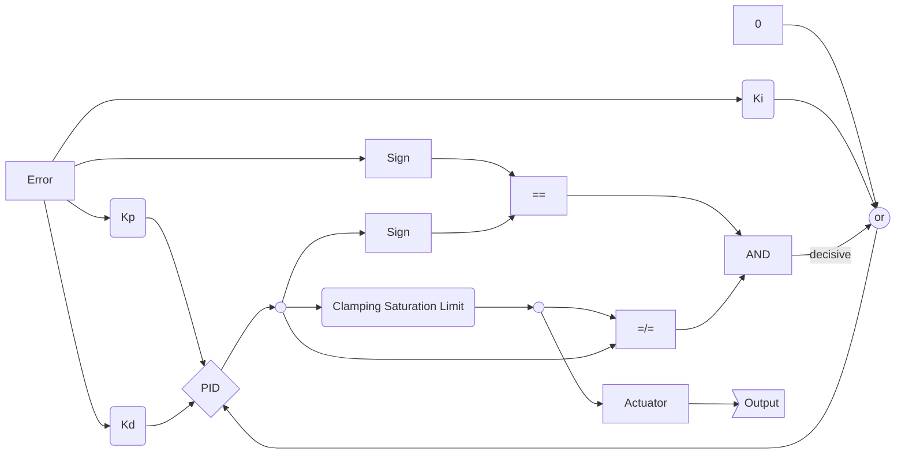

# RTOS: Maintaining drone position in real time constraints

This Arduino sketch provides a **flight controller** for an X quadcopter based on an **DoIt ESP32 Devkit V1** board and the **MPU6050 sensor** along with Android/ iOS application for controlling it.

## Files

Each .ino script consisnt of varius functions for different drone activities eg. mpu_data collects data from mpu6050.
For includes, variables and structures storing I used header file: libs_vars.h

## Requirements
### Arduino IDE ESP32 libraries:
Wifi
RemoteXY
ESP32Servo
I2Cdev
AutoPID
MPU6050_6Axis_MotionApps20
Wire

### Hardware:
DoIt ESP32 Devkit V1
MPU6050
4 ESC
4 Brushless Motors
LiPol Battery
Connectors
Cables

## Board and Pinout

Board used in this project is ==DoIt ESP32 Devkit V1==.
Thanks to dual core and WiFi/ BLE this board was perfect fit for Drone.
> Although small range of antena and the fact that it cant be replaced should be taken into consideration before choosing it.

### Hardware Connection

## PID controller

Fast graph made using [Mermaid](https://mermaidjs.github.io/). For improvement in the future.

## Android/ iOS App

Application was made using [RemoteXY](http://remotexy.com/en/) framework.

> App made for this project was made using **free** trial version.

## Project status

Currently under **active** development.

